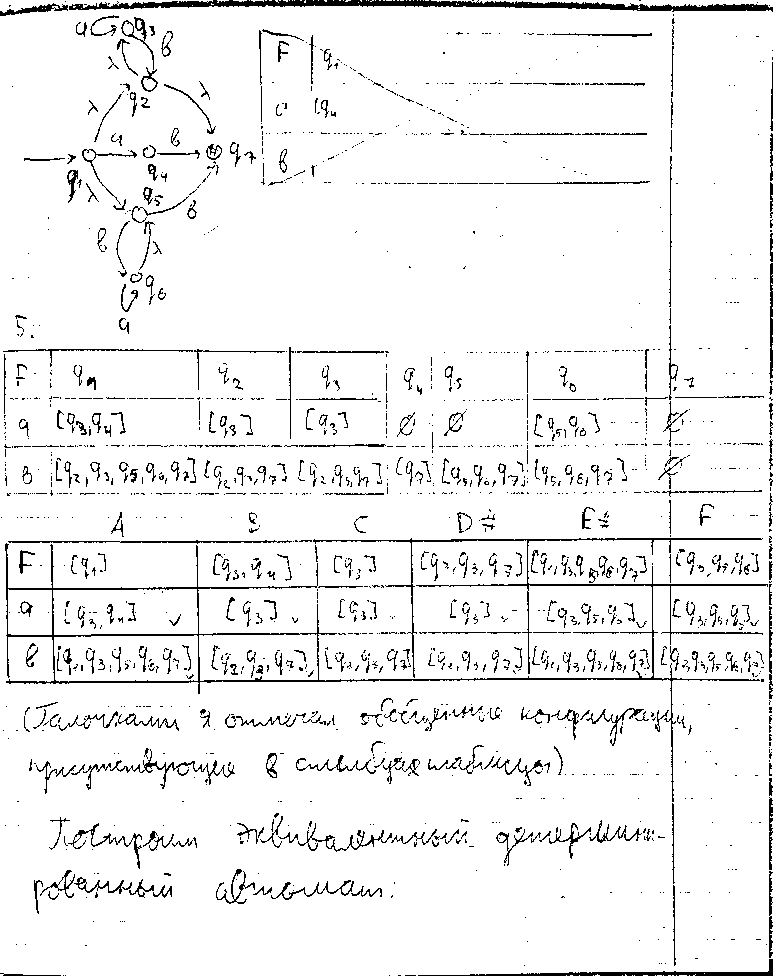
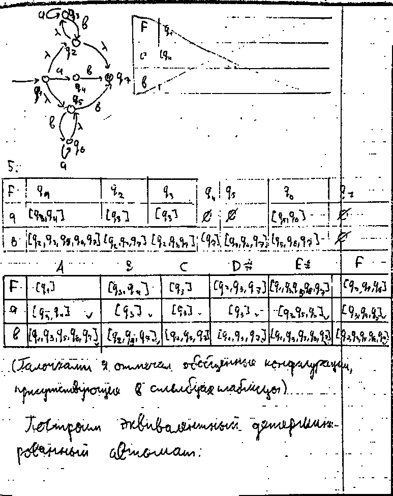
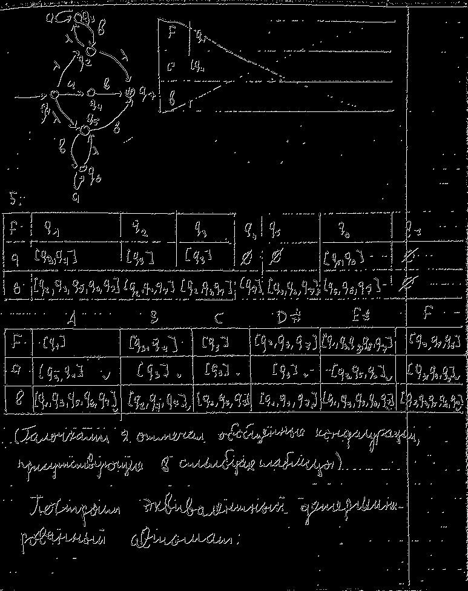
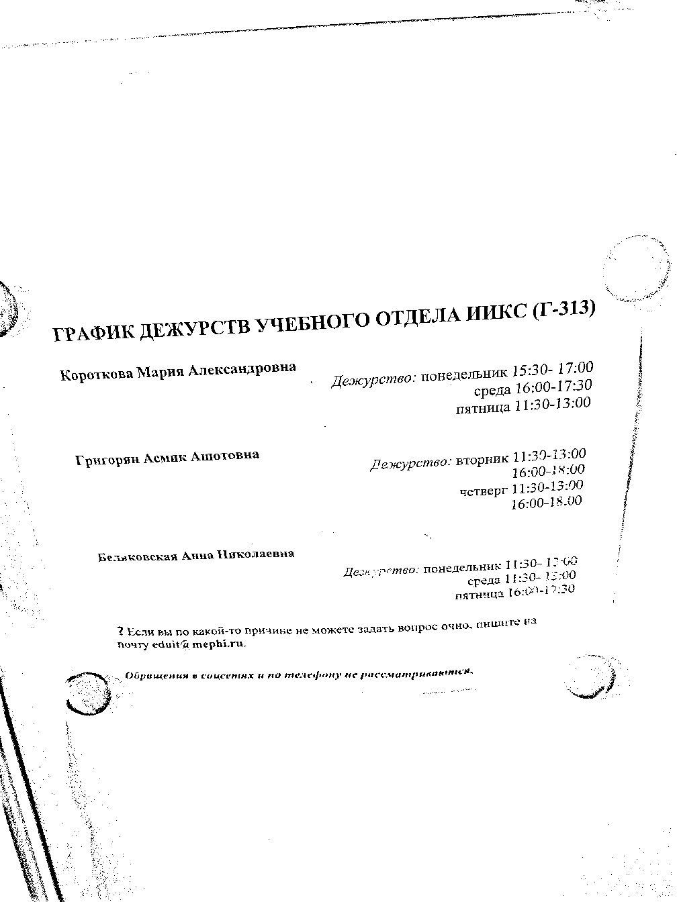
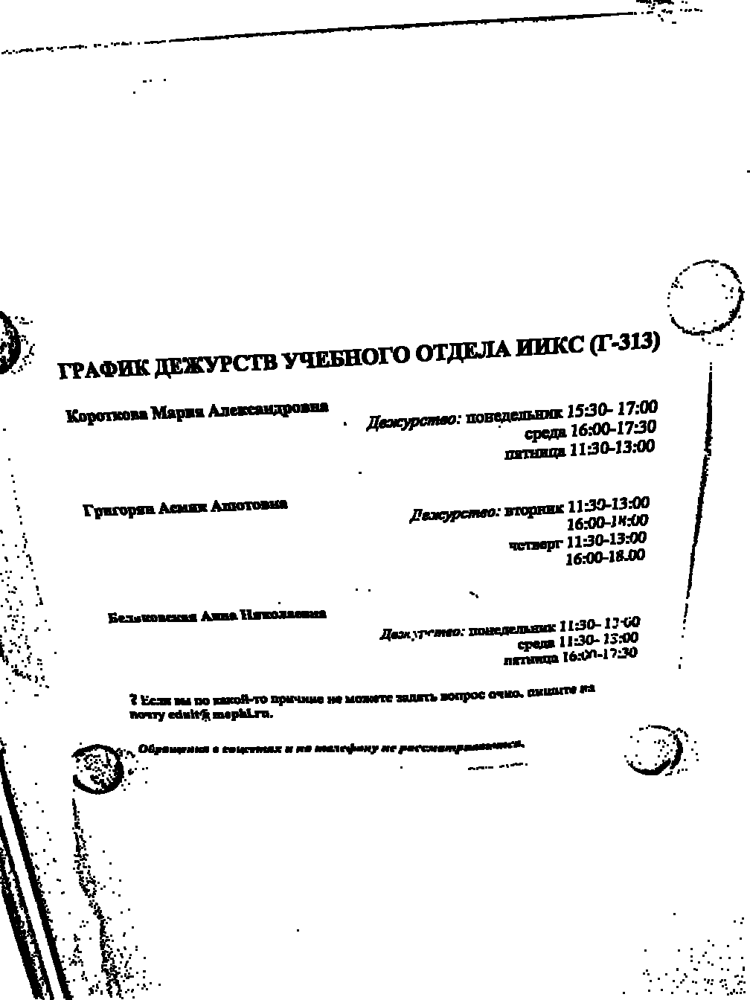
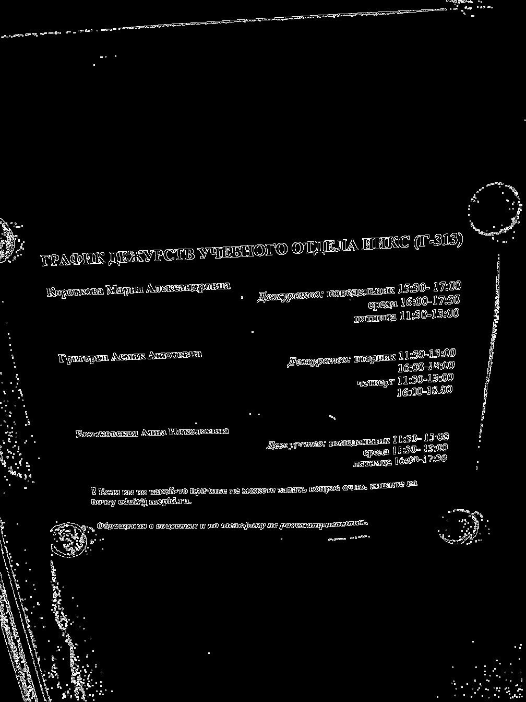
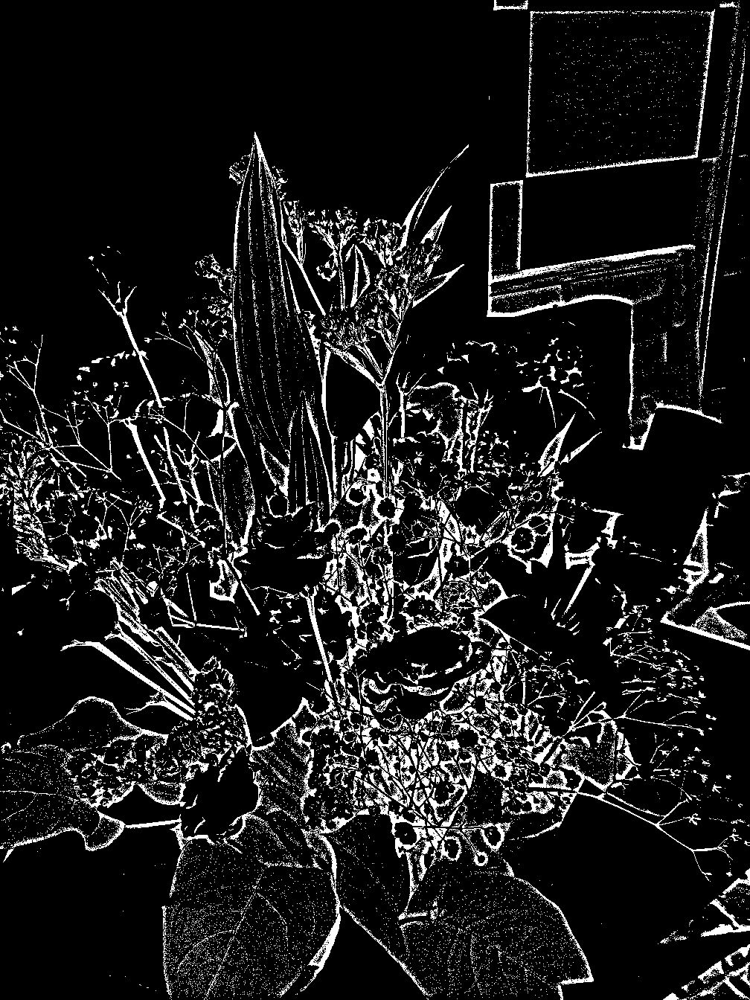
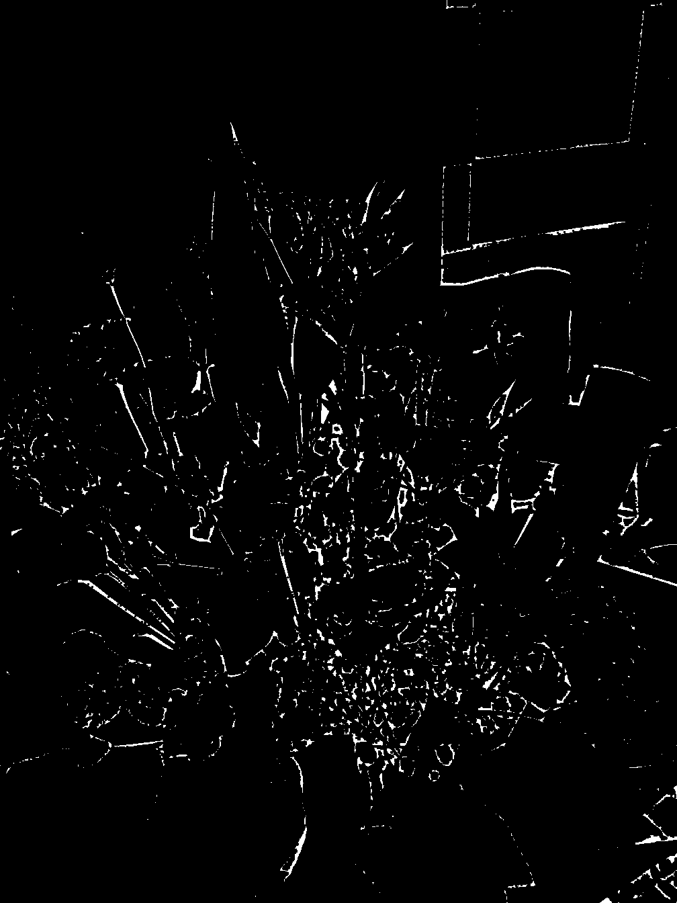
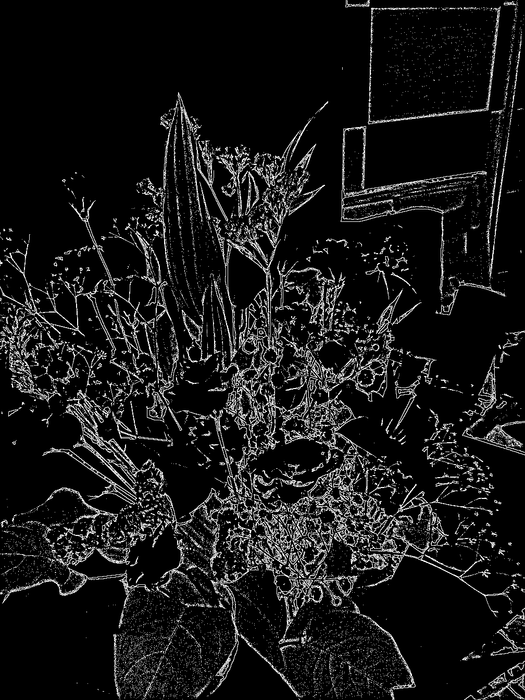

# Лабораторная работа №2. Фильтрация изображений и морфологические операции

Реализовано морфологическое преобразование открытия

## Результаты

### Изображение 1. Рукописный текст

\
Исходное изображение

\
Изображение после открытия

\
Разностное изображение

### Изображение 2. Печатный текст

\
Исходное изображение

\
Изображение после открытия

\
Разностное изображение

### Изображение 2. Цветы в негативе

\
Исходное изображение

\
Изображение после открытия

\
Разностное изображение

## Выводы

Операция открытия увеличивает размеры 
черных объектов на белом фоне.
Это может применяться, например, для восстановления линий, 
так как операция устраняет разрывы шириной 1-2 пикселя.
Однако такая операция усиливает шум типа "перец", 
увеличивая размеры элементов шума.

Для белых объектов на черном фоне размеры уменьшаются. 
Это может привести к потере деталей, 
однако также позволяет избавиться от шума типа "соль".

Разностное изображение между исходным и 
преобразованным изображениями может быть использовано 
для выделения контуров.
