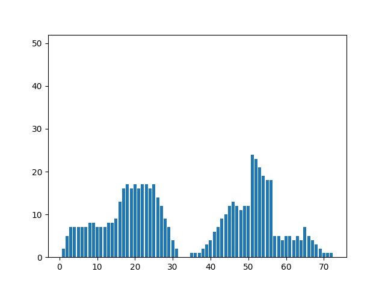

# Лабораторная работа №4. Выделение признаков символов

Греческий алфавит, заглавные буквы, шрифт Times New Roman, кегль 52.

Сгенерированы изображения символов, найдены их признаки и профили.

## Буквы

### Символ A

,  \

Признаки:
- Вес чёрного = 320
- Нормированный вес чёрного = 0.2275960170697012
- Центр масс = (21.421875, 19.871875)
- Нормированный центр масс = (0.5672743055555556, 0.5100506756756756)
- Моменты инерции = (21979.74687500001, 31488.046875)
- Нормированные моменты инерции = (0.214645965576172, 0.3075004577636718)
        

### Символ Β

,  \

Признаки:
- Вес чёрного = 496
- Нормированный вес чёрного = 0.4592592592592592
- Центр масс = (17.739919354838708, 15.294354838709678)
- Нормированный центр масс = (0.4782834101382488, 0.492908787541713)
- Моменты инерции = (34505.02419354839, 58255.44959677415)
- Нормированные моменты инерции = (0.1402552037003625, 0.2367953693937554)
        

### Символ Γ

,  \

Признаки:
- Вес чёрного = 259
- Нормированный вес чёрного = 0.2398148148148148
- Центр масс = (14.694980694980694, 9.822393822393822)
- Нормированный центр масс = (0.3912851627137341, 0.3042204766342697)
- Моменты инерции = (12113.830115830113, 38920.90347490351)
- Нормированные моменты инерции = (0.1805851152461965, 0.5802075621249462)
        

### Символ Δ

,  \

Признаки:
- Вес чёрного = 314
- Нормированный вес чёрного = 0.2813620071684587
- Центр масс = (21.515923566878985, 16.738853503184714)
- Нормированный центр масс = (0.5861692447679709, 0.5246284501061571)
- Моменты инерции = (17652.585987261158, 32618.420382165627)
- Нормированные моменты инерции = (0.1790395755128114, 0.3308290435937119)
        

### Символ Ε

,  \

Признаки:
- Вес чёрного = 364
- Нормированный вес чёрного = 0.3261648745519713
- Центр масс = (17.684065934065934, 12.085164835164836)
- Нормированный центр масс = (0.4766875981161695, 0.3695054945054945)
- Моменты инерции = (20476.35989010988, 52758.66758241756)
- Нормированные моменты инерции = (0.1545432306643965, 0.3981906441131623)
        

### Символ Ζ

,  \

Признаки:
- Вес чёрного = 356
- Нормированный вес чёрного = 0.3090277777777778
- Центр масс = (17.848314606741575, 15.820224719101123)
- Нормированный центр масс = (0.4813804173354735, 0.4780717651322942)
- Моменты инерции = (22680.49438202243, 56573.808988764176)
- Нормированные моменты инерции = (0.1789585783204648, 0.4463909937883804)
        

### Символ Η

,  \

Признаки:
- Вес чёрного = 524
- Нормированный вес чёрного = 0.3732193732193732
- Центр масс = (17.498091603053435, 18.98473282442748)
- Нормированный центр масс = (0.4713740458015267, 0.4732824427480916)
- Моменты инерции = (68789.87786259533, 63682.998091603215)
- Нормированные моменты инерции = (0.2505312840983746, 0.2319321356986889)
        

### Символ Θ

,  \

Признаки:
- Вес чёрного = 486
- Нормированный вес чёрного = 0.3552631578947368
- Центр масс = (18.516460905349795, 17.567901234567902)
- Нормированный центр масс = (0.4734178623067512, 0.47336860670194)
- Моменты инерции = (65249.25925925923, 47429.36831275718)
- Нормированные моменты инерции = (0.276250483747647, 0.2008051292687309)
        

### Символ Ι

,  \

Признаки:
- Вес чёрного = 244
- Нормированный вес чёрного = 0.4236111111111111
- Центр масс = (17.5, 7.5)
- Нормированный центр масс = (0.4714285714285714, 0.4333333333333333)
- Моменты инерции = (1405.0, 31613.0)
- Нормированные моменты инерции = (0.0235991668906208, 0.5309896533190003)
        

### Символ Κ

,  \

Признаки:
- Вес чёрного = 448
- Нормированный вес чёрного = 0.3111111111111111
- Центр масс = (18.982142857142858, 15.810267857142858)
- Нормированный центр масс = (0.5137755102040816, 0.3797504578754579)
- Моменты инерции = (36578.87276785716, 60237.85714285709)
- Нормированные моменты инерции = (0.1822528338640842, 0.3001328181942417)
        

### Символ Λ

,  \

Признаки:
- Вес чёрного = 292
- Нормированный вес чёрного = 0.2134502923976608
- Центр масс = (20.58904109589041, 20.20205479452055)
- Нормированный центр масс = (0.5596868884540118, 0.5189744539059608)
- Моменты инерции = (20801.078767123294, 29432.684931506905)
- Нормированные моменты инерции = (0.2439608600009769, 0.345194747273256)
        

### Символ Μ

,  \

Признаки:
- Вес чёрного = 591
- Нормированный вес чёрного = 0.3492907801418439
- Центр масс = (17.460236886632824, 24.629441624365484)
- Нормированный центр масс = (0.4702924824752235, 0.5136835135731627)
- Моменты инерции = (106367.84771573608, 66660.8155668359)
- Нормированные моменты инерции = (0.304533735633304, 0.1908515366333579)
        

### Символ Ν

,  \

Признаки:
- Вес чёрного = 370
- Нормированный вес чёрного = 0.2439024390243902
- Центр масс = (16.32972972972973, 19.762162162162163)
- Нормированный центр масс = (0.4258258258258258, 0.4690540540540541)
- Моменты инерции = (42767.07027027041, 41325.77297297295)
- Нормированные моменты инерции = (0.3123964227192871, 0.3018683197441413)
        

### Символ Ξ

,  \

Признаки:
- Вес чёрного = 379
- Нормированный вес чёрного = 0.3396057347670251
- Центр масс = (18.277044854881268, 14.944591029023746)
- Нормированный центр масс = (0.4936298529966076, 0.4648197009674582)
- Моменты инерции = (29651.836411609544, 66779.91029023753)
- Нормированные моменты инерции = (0.2064301725246242, 0.4649084195336814)
        

### Символ Ο

,  \

Признаки:
- Вес чёрного = 414
- Нормированный вес чёрного = 0.3026315789473684
- Центр масс = (18.615942028985508, 17.73671497584541)
- Нормированный центр масс = (0.4761065413239326, 0.478191856452726)
- Моменты инерции = (63126.3019323672, 46197.93478260882)
- Нормированные моменты инерции = (0.3683067395526569, 0.269539165339966)
        

### Символ Π

,  \

Признаки:
- Вес чёрного = 509
- Нормированный вес чёрного = 0.3625356125356125
- Центр масс = (16.80353634577603, 18.93909626719057)
- Нормированный центр масс = (0.4515296098793152, 0.4720814807155413)
- Моменты инерции = (67765.11198428288, 68838.35363457768)
- Нормированные моменты инерции = (0.2615595585329796, 0.2657020531593504)
        

### Символ Ρ

,  \

Признаки:
- Вес чёрного = 379
- Нормированный вес чёрного = 0.3630268199233716
- Центр масс = (14.854881266490764, 12.868073878627968)
- Нормированный центр масс = (0.3958537504711647, 0.4238597813795702)
- Моменты инерции = (22743.403693931457, 41189.01846965701)
- Нормированные моменты инерции = (0.1583350414848926, 0.2867497334998852)
        

### Символ Σ

,  \

Признаки:
- Вес чёрного = 335
- Нормированный вес чёрного = 0.3208812260536398
- Центр масс = (18.277611940298502, 12.62089552238806)
- Нормированный центр масс = (0.4936460554371001, 0.4150319829424306)
- Моменты инерции = (17588.85373134329, 59091.182089552414)
- Нормированные моменты инерции = (0.1567284805644312, 0.5265420547075288)
        

### Символ Τ

,  \

Признаки:
- Вес чёрного = 270
- Нормированный вес чёрного = 0.234375
- Центр масс = (14.322222222222225, 15.822222222222225)
- Нормированный центр масс = (0.3806349206349206, 0.4781362007168458)
- Моменты инерции = (10017.466666666667, 40800.96666666666)
- Нормированные моменты инерции = (0.137413808870599, 0.559684042066758)
        

### Символ Υ

,  \

Признаки:
- Вес чёрного = 300
- Нормированный вес чёрного = 0.219298245614035
- Центр масс = (15.466666666666669, 17.153333333333332)
- Нормированный центр масс = (0.4133333333333333, 0.4365765765765765)
- Моменты инерции = (15592.946666666678, 38988.66666666669)
- Нормированные моменты инерции = (0.173254962962963, 0.4332074074074077)
        

### Символ Φ

,  \

Признаки:
- Вес чёрного = 522
- Нормированный вес чёрного = 0.4027777777777778
- Центр масс = (17.53639846743295, 17.480842911877396)
- Нормированный центр масс = (0.4724685276409414, 0.4708812260536398)
- Моменты инерции = (46244.308429118704, 47901.80842911891)
- Нормированные моменты инерции = (0.169713848993404, 0.1757967749633699)
        

### Символ Χ

,  \

Признаки:
- Вес чёрного = 382
- Нормированный вес чёрного = 0.2792397660818713
- Центр масс = (17.26439790575916, 18.48429319371728)
- Нормированный центр масс = (0.4646970830216903, 0.4725484646950615)
- Моменты инерции = (29861.405759162262, 53618.2958115184)
- Нормированные моменты инерции = (0.2046366996461326, 0.3674398715188618)
        

### Символ Ψ

,  \

Признаки:
- Вес чёрного = 435
- Нормированный вес чёрного = 0.3020833333333333
- Центр масс = (14.08735632183908, 19.979310344827585)
- Нормированный центр масс = (0.3739244663382594, 0.4866489832007073)
- Моменты инерции = (41330.81379310341, 42624.68045977005)
- Нормированные моменты инерции = (0.2184215288313035, 0.2252592440732992)
        

### Символ Ω

,  \

Признаки:
- Вес чёрного = 490
- Нормированный вес чёрного = 0.3678678678678678
- Центр масс = (19.879591836734694, 17.56122448979592)
- Нормированный центр масс = (0.5244331065759638, 0.4731778425655977)
- Моменты инерции = (70142.66326530608, 63439.89591836734)
- Нормированные моменты инерции = (0.2921393722003585, 0.2642228068236874)
        

## Буквосочетания
Пары букв, которые не разделяются успешно в лабораторной работе 5

### Символ ΓA

,  \

Признаки:
- Вес чёрного = 579
- Нормированный вес чёрного = 0.2204035020936429
- Центр масс = (18.860103626943005, 33.61485319516407)
- Нормированный центр масс = (0.4961139896373057, 0.4659264742166296)
- Моменты инерции = (299375.1122625217, 75103.66839378234)
- Нормированные моменты инерции = (0.8930146141507803, 0.2240288878561463)
        

### Символ ΓΔ

,  \

Признаки:
- Вес чёрного = 573
- Нормированный вес чёрного = 0.2448717948717948
- Центр масс = (18.43280977312391, 32.24432809773124)
- Нормированный центр масс = (0.4980802792321117, 0.4881926265270506)
- Моменты инерции = (267379.7940663168, 78142.66317626539)
- Нормированные моменты инерции = (0.8143654507104666, 0.238001100043753)
        

### Символ ΓΛ

,  \

Признаки:
- Вес чёрного = 551
- Нормированный вес чёрного = 0.2155712050078247
- Центр масс = (17.818511796733212, 32.811252268602544)
- Нормированный центр масс = (0.4805289084780917, 0.4544464609800363)
- Моменты инерции = (291202.37023593497, 73121.85117967291)
- Нормированные моменты инерции = (0.9591614330517192, 0.2408485188773189)
        

### Символ ΡA

,  \

Признаки:
- Вес чёрного = 699
- Нормированный вес чёрного = 0.2737955346650998
- Центр масс = (18.40343347639485, 30.266094420600854)
- Нормированный центр масс = (0.4834287076776347, 0.4303837414794244)
- Моменты инерции = (295314.506437769, 78054.23175965651)
- Нормированные моменты инерции = (0.6044083136092006, 0.1597504543782278)
        

### Символ ΡΔ

,  \

Признаки:
- Вес чёрного = 693
- Нормированный вес чёрного = 0.3055555555555556
- Центр масс = (17.873015873015873, 29.12121212121212)
- Нормированный центр масс = (0.4820861678004535, 0.4535679374389051)
- Моменты инерции = (261357.81818181855, 81426.82539682496)
- Нормированные моменты инерции = (0.5442131439770173, 0.1695512648580735)
        

### Символ ΡΛ

,  \

Признаки:
- Вес чёрного = 671
- Нормированный вес чёрного = 0.2701288244766505
- Центр масс = (17.350223546944857, 29.549925484351714)
- Нормированный центр масс = (0.4671492441984244, 0.4198518453581134)
- Моменты инерции = (285908.0774962742, 76044.69746646786)
- Нормированные моменты инерции = (0.6350111995492952, 0.1688977624571459)
        

### Символ ΤA

,  \

Признаки:
- Вес чёрного = 590
- Нормированный вес чёрного = 0.2184376156978896
- Центр масс = (18.63050847457627, 37.00169491525424)
- Нормированный центр масс = (0.4897363465160075, 0.5000235404896421)
- Моменты инерции = (255300.99830508488, 77737.45084745767)
- Нормированные моменты инерции = (0.7334128075411803, 0.2233193072319956)
        

### Символ ΤΔ

,  \

Признаки:
- Вес чёрного = 584
- Нормированный вес чёрного = 0.24212271973466
- Центр масс = (18.190068493150687, 35.67123287671233)
- Нормированный центр масс = (0.4911448140900196, 0.5253217102532172)
- Моменты инерции = (225514.8767123288, 80931.90239726024)
- Нормированные моменты инерции = (0.6612253609739421, 0.2372979874192515)
        

### Символ ΤΛ

,  \

Признаки:
- Вес чёрного = 562
- Нормированный вес чёрного = 0.2138508371385083
- Центр масс = (17.57829181494662, 36.28291814946619)
- Нормированный центр масс = (0.4736654804270463, 0.4900405298536971)
- Моменты инерции = (248368.0160142345, 75743.0551601426)
- Нормированные моменты инерции = (0.7863629387109919, 0.2398116005374254)
        

### Символ ΥA

,  \

Признаки:
- Вес чёрного = 620
- Нормированный вес чёрного = 0.2148302148302148
- Центр масс = (19.024193548387096, 39.20161290322581)
- Нормированный центр масс = (0.5006720430107526, 0.4961248428990364)
- Моменты инерции = (320133.7983870963, 74278.63709677395)
- Нормированные моменты инерции = (0.8328142517874514, 0.1932326667449894)
        

### Символ ΥΔ

,  \

Признаки:
- Вес чёрного = 614
- Нормированный вес чёрного = 0.2368827160493827
- Центр масс = (18.560260586319217, 37.90879478827362)
- Нормированный центр масс = (0.5017217310376919, 0.5198421801165298)
- Моменты инерции = (285956.8925081437, 77221.27035830662)
- Нормированные моменты инерции = (0.7585143940735277, 0.2048331291533772)
        

### Символ ΥΛ

,  \

Признаки:
- Вес чёрного = 592
- Нормированный вес чёрного = 0.2108262108262108
- Центр масс = (17.993243243243242, 38.38682432432432)
- Нормированный центр масс = (0.4855212355212355, 0.485543173043173)
- Моменты инерции = (310616.41722972965, 72303.97297297274)
- Нормированные моменты инерции = (0.8863004965694897, 0.2063092727725893)
        

### Символ ΨA

,  \

Признаки:
- Вес чёрного = 755
- Нормированный вес чёрного = 0.2519185852519185
- Центр масс = (17.772185430463576, 38.158940397351)
- Нормированный центр масс = (0.4658940397350993, 0.4644867549668874)
- Моменты инерции = (402510.9271523175, 81510.81589403942)
- Нормированные моменты инерции = (0.7061285507693829, 0.1429951596755219)
        

### Символ ΨΔ

,  \

Признаки:
- Вес чёрного = 749
- Нормированный вес чёрного = 0.2774074074074074
- Центр масс = (17.201602136181574, 37.06675567423231)
- Нормированный центр масс = (0.4629029181766164, 0.4873885901923285)
- Моменты инерции = (361950.6622162886, 85306.55807743674)
- Нормированные моменты инерции = (0.6451871961302896, 0.1520613297969821)
        

### Символ ΨΛ

,  \

Признаки:
- Вес чёрного = 727
- Нормированный вес чёрного = 0.2493141289437585
- Центр масс = (16.698762035763412, 37.33975240715268)
- Нормированный центр масс = (0.4485360581646689, 0.4542469050894085)
- Моменты инерции = (388541.08115543344, 79443.02888583206)
- Нормированные моменты инерции = (0.7351367307289353, 0.1503096876156881)
        

### Символ AΤ

,  \

Признаки:
- Вес чёрного = 590
- Нормированный вес чёрного = 0.2214714714714714
- Центр масс = (18.63050847457627, 36.32372881355932)
- Нормированный центр масс = (0.4897363465160075, 0.4975173072332298)
- Моменты инерции = (221261.16779661, 77737.45084745767)
- Нормированные моменты инерции = (0.6356253024895432, 0.2233193072319956)
        

### Символ ΔΤ

,  \

Признаки:
- Вес чёрного = 584
- Нормированный вес чёрного = 0.2457912457912457
- Центр масс = (18.190068493150687, 32.034246575342465)
- Нормированный центр масс = (0.4911448140900196, 0.477449947312961)
- Моменты инерции = (186561.31506849345, 80931.90239726024)
- Нормированные моменты инерции = (0.5470107990139257, 0.2372979874192515)
        

### Символ ΛΤ

,  \

Признаки:
- Вес чёрного = 562
- Нормированный вес чёрного = 0.2168209876543209
- Центр масс = (17.57829181494662, 37.31494661921708)
- Нормированный центр масс = (0.4736654804270463, 0.5114781213974237)
- Моменты инерции = (208811.2544483983, 75743.0551601426)
- Нормированные моменты инерции = (0.6611214854434414, 0.2398116005374254)
        

### Символ AΥ

,  \

Признаки:
- Вес чёрного = 620
- Нормированный вес чёрного = 0.2148302148302148
- Центр масс = (19.024193548387096, 37.91129032258065)
- Нормированный центр масс = (0.5006720430107526, 0.4793674067867616)
- Моменты инерции = (252784.12096774203, 74278.63709677395)
- Нормированные моменты инерции = (0.6576069744218055, 0.1932326667449894)
        

### Символ ΔΥ

,  \

Признаки:
- Вес чёрного = 614
- Нормированный вес чёрного = 0.2368827160493827
- Центр масс = (18.560260586319217, 33.55374592833876)
- Нормированный центр масс = (0.5017217310376919, 0.4585034637794192)
- Моменты инерции = (214949.726384365, 77221.27035830662)
- Нормированные моменты инерции = (0.5701644749131688, 0.2048331291533772)
        

### Символ ΛΥ

,  \

Признаки:
- Вес чёрного = 592
- Нормированный вес чёрного = 0.2108262108262108
- Центр масс = (17.993243243243242, 38.92736486486486)
- Нормированный центр масс = (0.4855212355212355, 0.49256318006318)
- Моменты инерции = (238435.8766891891, 72303.97297297274)
- Нормированные моменты инерции = (0.6803434209767312, 0.2063092727725893)
        

### Символ AΨ

,  \

Признаки:
- Вес чёрного = 755
- Нормированный вес чёрного = 0.2550675675675675
- Центр масс = (17.772185430463576, 42.980132450331126)
- Нормированный центр масс = (0.4658940397350993, 0.5313940816497611)
- Моменты инерции = (359890.70198675484, 81510.81589403942)
- Нормированные моменты инерции = (0.6313595052616198, 0.1429951596755219)
        

### Символ ΔΨ

,  \

Признаки:
- Вес чёрного = 749
- Нормированный вес чёрного = 0.2811561561561561
- Центр масс = (17.201602136181574, 38.367156208277706)
- Нормированный центр масс = (0.4629029181766164, 0.5118788521681877)
- Моменты инерции = (311894.0320427236, 85306.55807743674)
- Нормированные моменты инерции = (0.5559598504151037, 0.1520613297969821)
        

### Символ ΛΨ

,  \

Признаки:
- Вес чёрного = 727
- Нормированный вес чёрного = 0.2524305555555555
- Центр масс = (16.698762035763412, 44.00275103163686)
- Нормированный центр масс = (0.4485360581646689, 0.5443386206536311)
- Моменты инерции = (338575.9944979367, 79443.02888583206)
- Нормированные моменты инерции = (0.6406005999631745, 0.1503096876156881)

## Спец.символы        

### Символ ´ (Псили)

,  \

Признаки:
- Вес чёрного = 28
- Нормированный вес чёрного = 0.1111111111111111
- Центр масс = (2.7142857142857144, 2.6785714285714284)
- Нормированный центр масс = (0.0489795918367347, 0.2797619047619047)
- Моменты инерции = (84.10714285714288, 137.71428571428572)
- Нормированные моменты инерции = (0.1072795189504373, 0.1756559766763848)