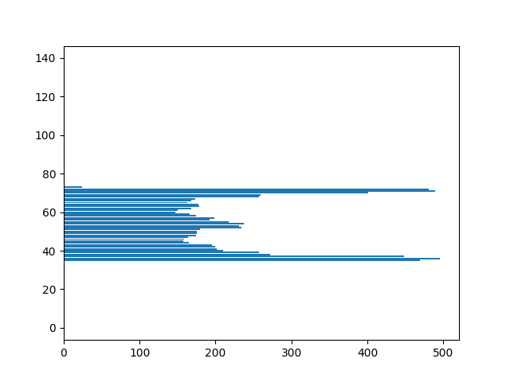
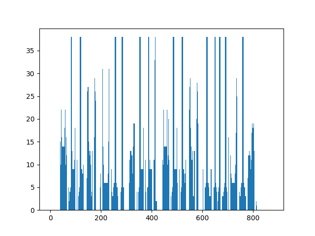

# Лабораторная работа №5. Выделение признаков символов

Греческий алфавит, заглавные буквы, шрифт Times New Roman, кегль 52.

Из исходного изображения выделена область, содержащая текст. 
Затем данная область сегментирована на символы. Обе операции 
реализованы с использованием профилей.

## Результат

### Исходное изображение

### Профиль по оси X

### Профиль по оси Y

### Выделенная область

### Выделенные символы

_Замечание_: каждый выделенный символ сохранялся в 
отдельный файл для удобства дальнейшей обработки.

## Выводы

Алгоритм выделения символов на основе профилей хорошо справляется 
с разделением символов, имеющих одинаковую ширину в верхней и 
нижней части. Однако возникают проблемы, если рядом находятся 
символ с широким основанием (например, Т или Г) и узкой вершиной 
и символ с узким основанием и широкой вершиной 
(как например А или Δ). Также не всегда выделяется псили (символ,
похожий на апостроф), так как иногда он частично находится над 
буквой (как в случае с ´O) или не имеет разделения с буквой 
(например, Т´)
