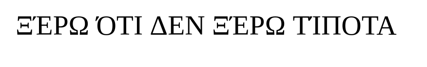
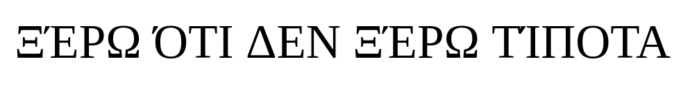

# Лабораторная работа №6. Классификация на основе признаков, анализ профилей

Греческий алфавит, заглавные буквы, шрифт Times New Roman, кегль 52.

Сначала проведено выделение текстовой области и 
сегментация текста на символы (см. лабораторную
работу №5). Далее для каждого полученного символа проведена
классификация на основе признаков и профилей, полученных в 
лабораторной работе №4, при чем профилям отдается предпочтение
при получении итогового результата. Для сравнения профилей 
используется расстояние Левенштейна.

## Распознавание символов для шрифта того же размера

Замечание: по факту, размер может отличаться на 1-2 пикселя 
в результате того, что исходное изображение является скриншотом
строки, введенной в Word, а не сгенерировано той же библиотекой,
которой генерировались символы, для которых посчитаны признаки.

### Исходное изображение:

### Лучшие гипотезы:

0: 'Ξ' - 0.9956119036347866 по признакам, 0.7519812397028574 по профилям;\
1: '´' - 0.9931586360167856 по признакам;\
2: 'Ε' - 0.9983495612405201 по признакам, 0.7068922928550894 по профилям;\
3: 'Ρ' - 0.9975594528928954 по признакам, 0.7827913059976794 по профилям;\
4: 'Ω' - 0.9981286099587175 по признакам, 0.7031924678006294 по профилям;\
5: 'Ο' - 0.9944671883163162 по признакам, 0.48334182845410933 по профилям;\
6: 'Τ' - 0.9963956275435674 по признакам, 0.7801674929082083 по профилям;\
7: 'Ι' - 0.9779817098741834 по признакам, 0.7774878905430482 по профилям;\
8: 'Δ' - 0.9956838504578662 по признакам, 0.67137809819914 по профилям;\
9: 'Ε' - 0.9985744286482047 по признакам, 0.7009158434830542 по профилям;\
10: 'Ν' - 0.9810716905554502 по признакам, 0.6846794734062915 по профилям;\
11: 'Ξ' - 0.9956119036347866 по признакам, 0.7519812397028574 по профилям;\
12: '´' - 0.9931586360167856 по признакам;\
13: 'Ε' - 0.9983495612405201 по признакам, 0.7068922928550894 по профилям;\
14: 'Ρ' - 0.9965730103903997 по признакам, 0.7533252662728305 по профилям;\
15: 'Ω' - 0.9981286099587175 по признакам, 0.7031924678006294 по профилям;\
16: 'Υ' - 0.9870071365343076 по признакам, 0.46756494322184394 по профилям;\
17: 'Ι' - 0.9779817098741834 по признакам, 0.7774878905430482 по профилям;\
18: 'Π' - 0.9882835621634766 по признакам, 0.722784293819265 по профилям;\
19: 'Ο' - 0.9949725523701054 по признакам, 0.756414017826131 по профилям;\
20: 'ΤΔ' - 0.9143444289666725 по признакам, 0.8136972072732274 по профилям.

### Полученная строка:
Ξ´ΕΡΩΟΤΙΔΕΝΞ´ΕΡΩΥΙΠΟΤΔ

### Точность: ~91%

## Распознавание символов для шрифта большего размера

Данное изображение содержит текст со шрифтом, на 10 пунктов 
большим, чем предыдущее.

### Исходное изображение:

### Лучшие гипотезы:

0: 'Ξ' - 0.9938716681300064 по признакам, 0.5113996308961055 по профилям;\
1: '´' - 0.9969029781143488 по признакам;\
2: 'Ε' - 0.9965482526409852 по признакам, 0.4473813616240001 по профилям;\
3: 'Ρ' - 0.995253976478143 по признакам, 0.38553346706948866 по профилям;\
4: 'Ω' - 0.9944415354229751 по признакам, 0.41092530526374615 по профилям;\
5: 'Μ' - 0.9738428058425065 по признакам, 0.3757218550983712 по профилям;\
6: 'Υ' - 0.9927700346275485 по признакам, 0.4872301449876152 по профилям;\
7: 'Ι' - 0.9736356030673039 по признакам, 0.43105532631890453 по профилям;\
8: 'Ν' - 0.9259366162672149 по признакам, 0.41859444555923375 по профилям;\
9: 'Κ' - 0.9882101564858106 по признакам, 0.4758715822039694 по профилям;\
10: 'Μ' - 0.9784194182568714 по признакам, 0.5134935317649121 по профилям;\
11: 'Ξ' - 0.9939051554360819 по признакам, 0.5263977910958177 по профилям;\
12: '´' - 0.9969589309894531 по признакам;\
13: 'Κ' - 0.9880993700099964 по признакам, 0.4756138079816363 по профилям;\
14: 'Ρ' - 0.9969079952268104 по признакам, 0.34805863281787786 по профилям;\
15: 'Ω' - 0.9952107979850964 по признакам, 0.40467196125042315 по профилям;\
16: 'Ν' - 0.9438795993933949 по признакам, 0.32787744888692383 по профилям;\
17: 'Ι' - 0.9960522212478347 по признакам, 0.5046250457495095 по профилям;\
18: 'Π' - 0.9975523815606374 по признакам, 0.49483466074333926 по профилям;\
19: 'Ο' - 0.9933050370568108 по признакам, 0.436939917374071 по профилям;\
20: 'ΨΔ' - 0.9127648374275834 по признакам, 0.5877009401189206 по профилям;

### Полученная строка:
Ξ´ΕΡΩΜΥΙΝΚΜΞ´ΚΡΩΝΙΠΟΨΔ

### Точность: ~59%

## Выводы
Методы распознавания текста на основе признаков и профилей хорошо 
подходят в случае, если распознаваемый текст имеет такой же или
близкий размер шрифта, как и текст, для которого были вычислены 
признаки и профили. Если же размер существенно отличается, то
данный метод показывает довольно плохие результаты.
