# Лабораторная работа №7. Текстурный анализ и контрастирование

- Параметры матрицы Харалика: d=1, phi = {45, 135, 225, 315}

- Расчет корелляции

- Кусочно-линейное контрастирование

- Повторное назожение матрицы Харалика и вычисление корелляции 
для контарстированного изображения

## Изображение 1. Ковер

### Исходное изображение

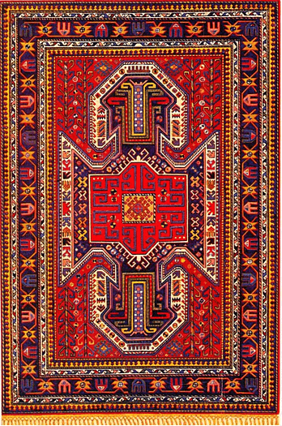

### Полутоновое изображение

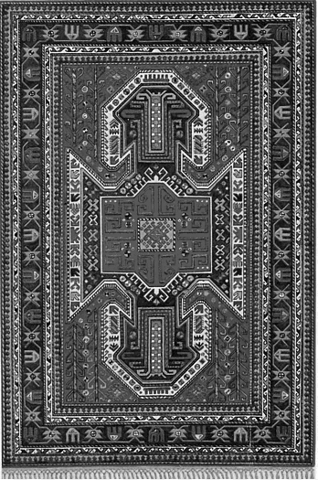

### Матрица Харалика

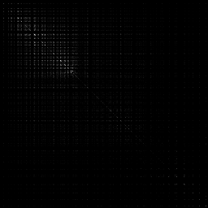

### Корелляция: -5.11850115574678e-25

### Гистограммы

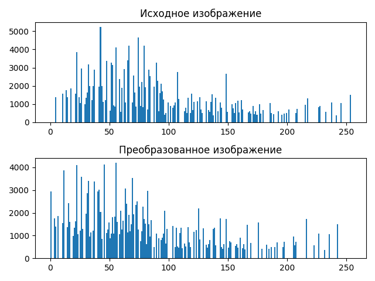

### Преобразованное изображение

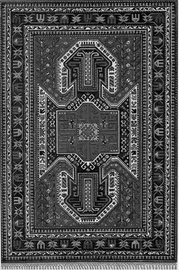

### Матрица Харалика для преобразованного изображения

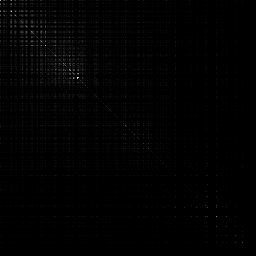

### Корелляция: -5.504346340411345e-25

## Изображение 2. Ткань

### Исходное изображение

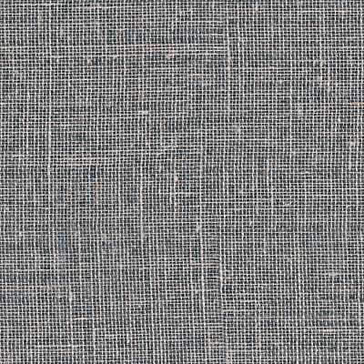

### Полутоновое изображение

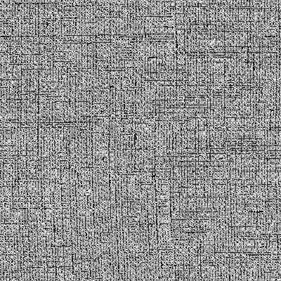

### Матрица Харалика

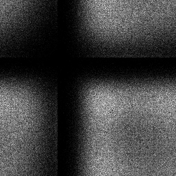

### Корелляция: -1.6126538550883197e-31

### Гистограммы

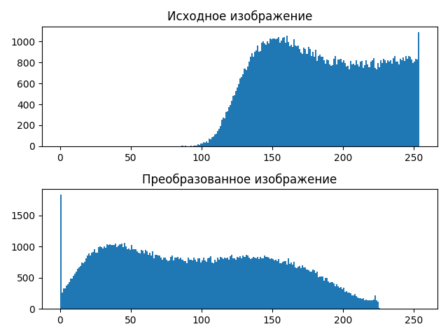

### Преобразованное изображение

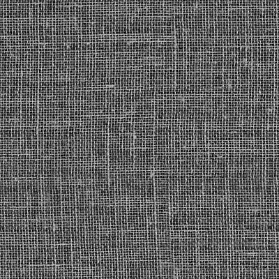

### Матрица Харалика для преобразованного изображения

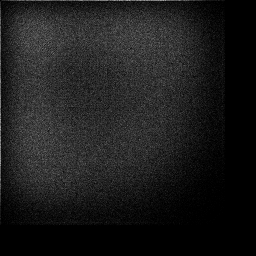

### Корелляция: -8.778472817170237e-30

## Изображение 3. Доски 

### Исходное изображение

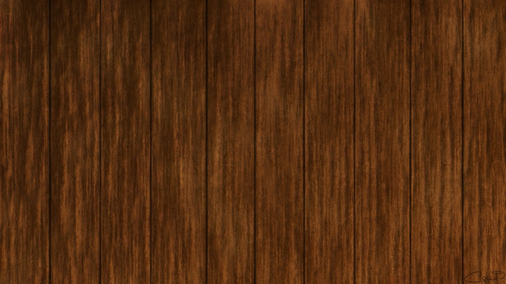

### Полутоновое изображение

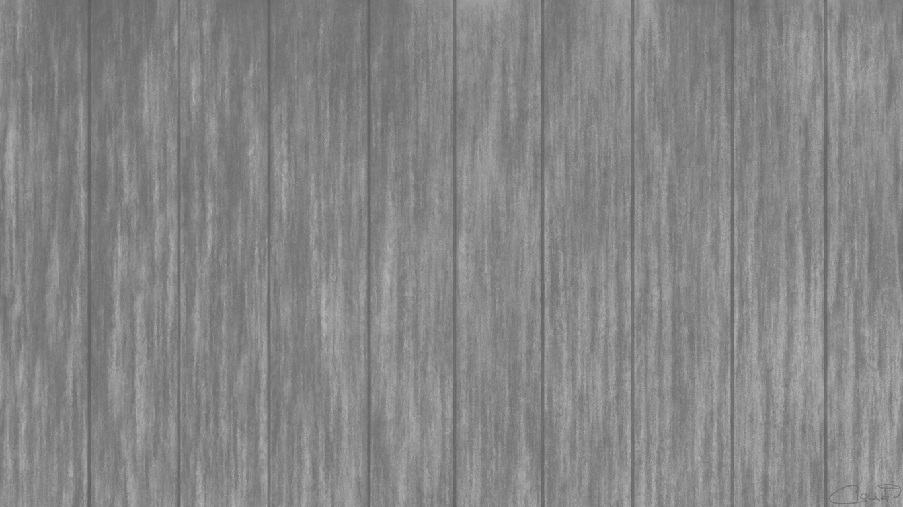

### Матрица Харалика

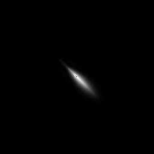

### Корелляция: -5.127885449510635e-25

### Гистограммы

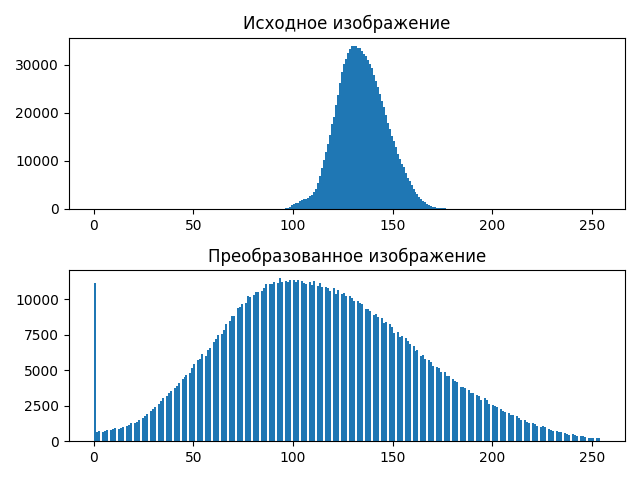

### Преобразованное изображение

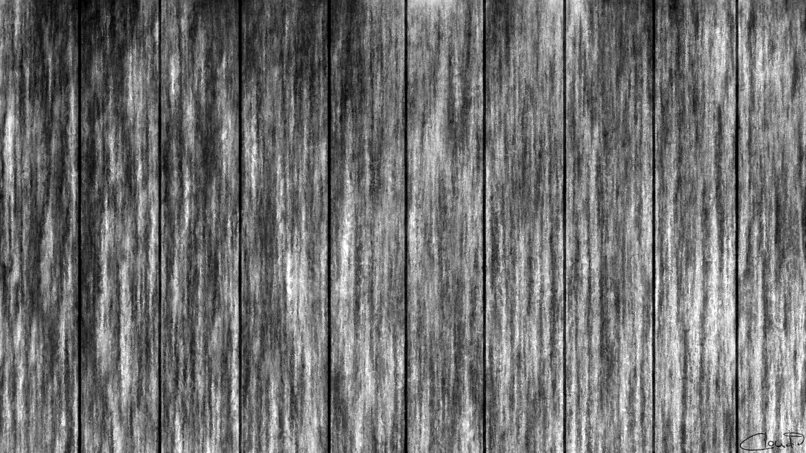

### Матрица Харалика для преобразованного изображения

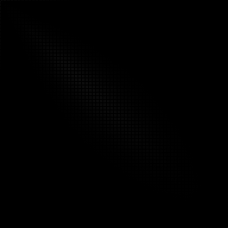

### Корелляция: -1.8777786309721848e-23

## Выводы. 

Кусочно-линейное контрастирование обынчно делает изображение 
более распознаваемым с точки зрения человека, а с точки зрения
текстурного анализа оно делает матрицу Харалика более светлой и
как правило увеличивает ее корелляцию.