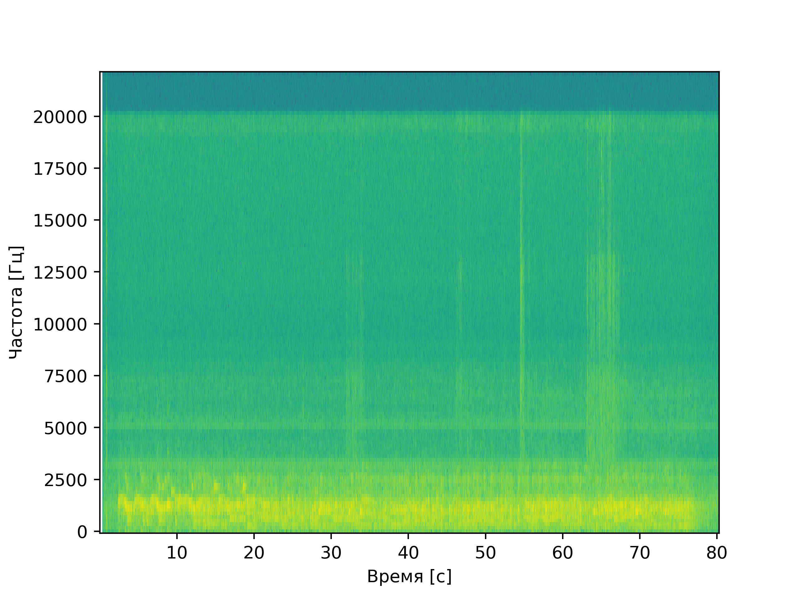
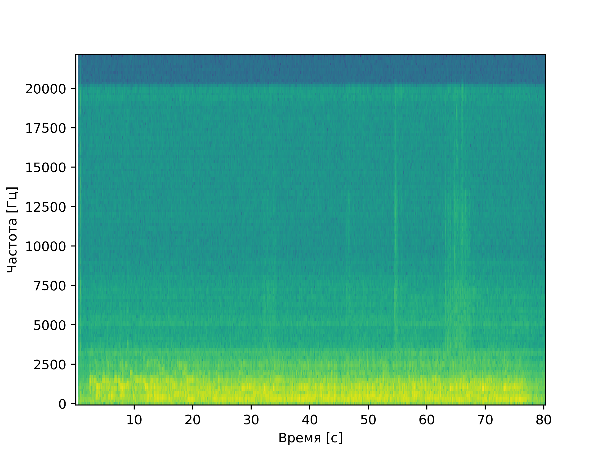
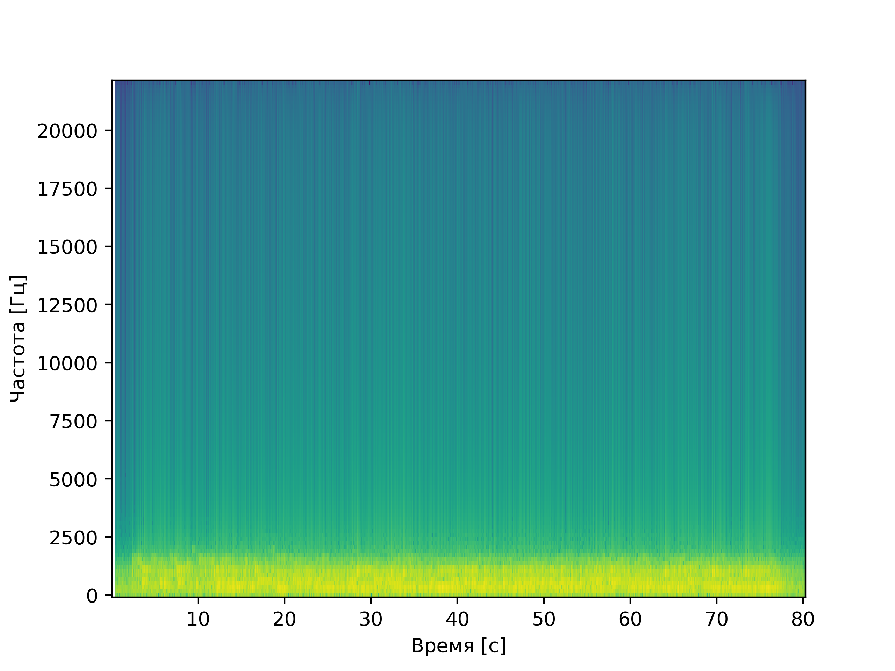

# Лабораторная работа №8. Анализ шума

Была предварительно записана игра на пианино. Запись имела заметный 
фоновый шум. Далее данная запись была преобразована в формат WAV.
Построена спектрограмма, проведено устранение шума с помощью 
фильтра Савицкого-Голея и фильтра нижних частот (lowpass).

## Спектрограмма исходного звука

## Спектрограмма после фильтра Савицкого-Голея

Теперь после ослабления шума на всем диапазоне можно наблюдать, 
что полезная составляющая звука находится на более низких частотах,
чем большая часть оставшегося шума. Поэтому применим 
lowpass-фильтр

## Спектрограмма после фильтра Савицкого-Голея и одного прохода lowpass

## Спектрограмма после фильтра Савицкого-Голея и двух проходов lowpass

## Выводы

Фильтр Савицкого-Голея хорошо подходит для устранения шума на
всем диапазоне частот, а lowpass-фильтр хорошо устраняет 
высокочастотные шумы
